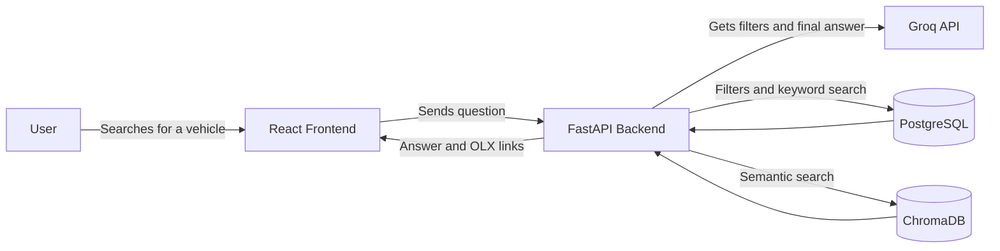
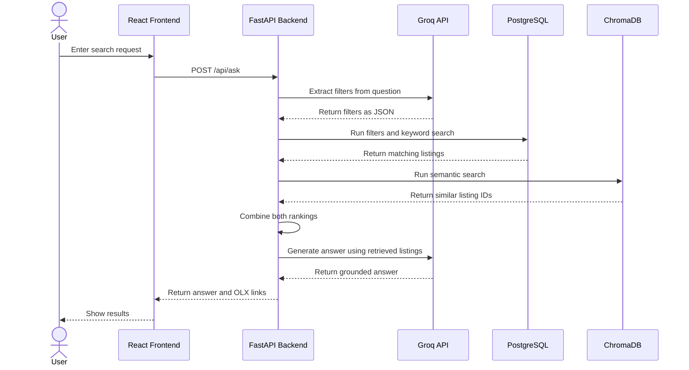
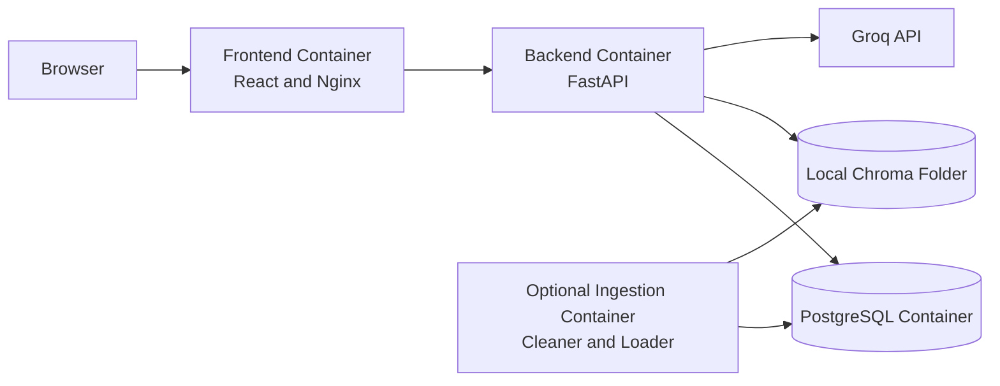
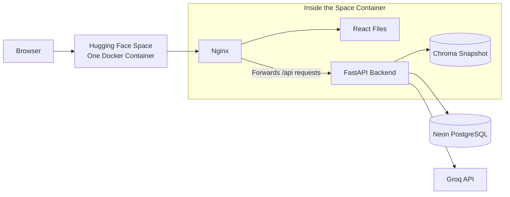

# OLX Vehicle Finder

## Overview

This is a RAG-based vehicle finder made using scraped OLX Pakistan listings. A user can search in normal language, for example `show family cars under 35 lakh in Lahore`, and the app returns relevant listings with their actual OLX links.

I made this project to understand how RAG works when the data is not a set of long documents. In this case, every vehicle listing is already a small document. The system stores normal listing fields in PostgreSQL and embeddings in ChromaDB.

## Main Technologies

| Technology | Use |
|---|---|
| React | Frontend |
| FastAPI | Backend API |
| PostgreSQL | Listing details and exact filters |
| ChromaDB | Embeddings for semantic search |
| Sentence Transformers | Creates embeddings locally |
| Groq API | Extracts filters and writes the final answer |
| Nginx | Serves React files and forwards API requests |
| Docker | Packages the app for Hugging Face Spaces |
| Neon | Hosts PostgreSQL for the deployed app |

## Improvements Made

The first version was closer to a simple vector search demo. I added a few things to make the RAG flow more complete:

- Added PostgreSQL filters for fields such as price, city, year, fuel type and gearbox.
- Added PostgreSQL full-text search along with Chroma semantic search.
- Combined both rankings using reciprocal rank fusion.
- Added a distance threshold so weak vector matches are not shown.
- Used the same listing IDs in PostgreSQL and ChromaDB.
- Updated the cleaner so listing text is more useful before embeddings are created.
- Added a React frontend instead of keeping the basic Streamlit interface.
- Added retrieval evaluation queries and cleaner tests.
- Moved the deployed PostgreSQL database to Neon.
- Packaged the public demo as one Hugging Face Docker Space.

## Architecture

These are four simple views of the system. They are based on the C4 style, with a sequence diagram added to make the search flow easier to explain.

### 1. User Flow



### 2. Search Sequence



### 3. Local Docker Containers

This was the local setup used while building and testing the project.



Normally, three local containers run: frontend, backend and PostgreSQL. The ingestion container is only used when loading fresh data.

### 4. Deployed App

The deployed version is smaller than the local setup. Neon hosts PostgreSQL separately. Hugging Face Spaces runs one Docker container for the frontend, backend and ChromaDB files.



## Where ChromaDB Is Stored

PostgreSQL and ChromaDB are not the same database. PostgreSQL stores the readable listing details. ChromaDB stores the embedding vectors used for semantic search.

While working locally, ChromaDB is stored in:

```text
scraper/chroma_data/
```

For deployment, I copied the finished Chroma folder into:

```text
deploy/huggingface/chroma_data/
```

This copied folder is the **Chroma snapshot**. Snapshot just means a saved copy of the vector database at that point in time. It is included in the Hugging Face Docker image, so the deployed backend can search embeddings without depending on my laptop.

The current snapshot contains 6 files and is about 2.94 MB. If listings are refreshed later, Neon must be updated and a new Chroma snapshot must be uploaded to the Space.
