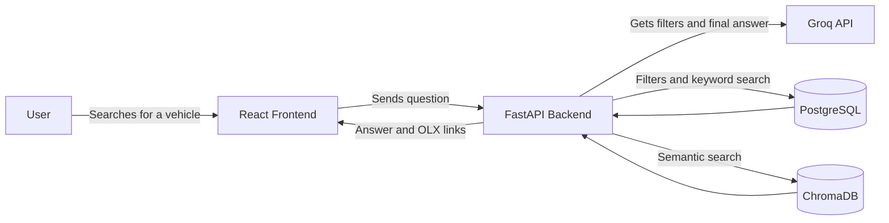
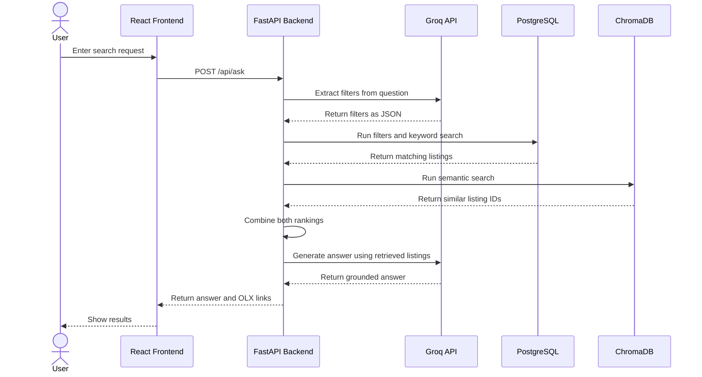
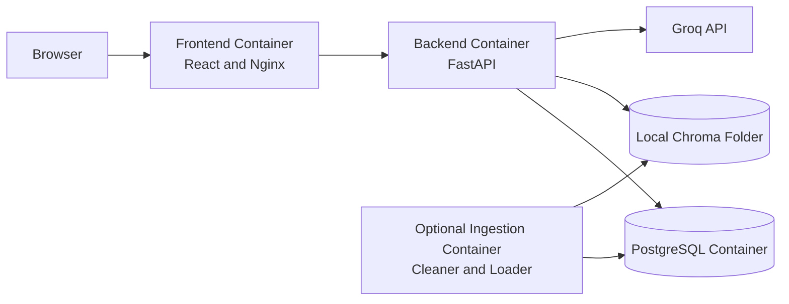
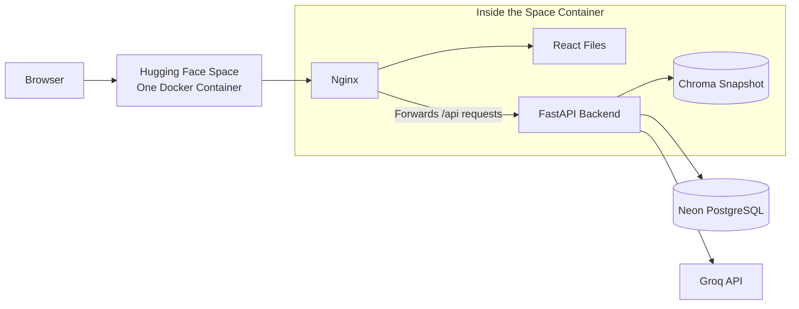

# OLX Vehicle Finder

## Overview

This is a small RAG project I made using vehicle listings scraped from OLX Pakistan. The user can search in normal language, for example `show family cars under 35 lakh in Lahore`, and the app shows relevant listings with the original OLX links.

I wanted to understand how a RAG app works from start to finish, including collecting the data, cleaning it, creating embeddings, retrieving the right listings and finally deploying the app.

## Main Technologies

| Technology | Use |
|---|---|
| React | Frontend |
| FastAPI | Backend API |
| PostgreSQL | Listing details and exact filters |
| ChromaDB | Embeddings for semantic search |
| Sentence Transformers | Creates embeddings for semantic search |
| Groq API | Extracts filters and writes the final answer |
| Nginx | Serves the React page and forwards API requests |
| Docker | Used for the deployed Hugging Face Space |
| Neon | Hosts the PostgreSQL database online |

## Changes I Made

The first version was more basic. These are some of the changes I made while improving it:

- I added filters for price, city, year, fuel type and gearbox.
- I used both PostgreSQL text search and Chroma semantic search instead of relying on only one search method.
- I combined the results using reciprocal rank fusion.
- I used the same listing IDs in PostgreSQL and ChromaDB so the results can be linked correctly.
- I improved the cleaning step before creating embeddings.
- I replaced the first Streamlit UI with a React frontend.
- I added a few tests and evaluation queries.
- I moved PostgreSQL to Neon for the online version.
- I deployed the frontend and backend together in one Docker Space on Hugging Face.

## Architecture

These diagrams show the main parts of the project and how a search request moves through them.

### 1. User Flow



### 2. Search Sequence



### 3. Local Docker Containers

This was the local setup I used while building the project.



Normally, I used three local containers: frontend, backend and PostgreSQL. The ingestion container was only needed when loading fresh data.

### 4. Deployed App

For the deployed version, Neon hosts PostgreSQL separately. Hugging Face Spaces runs one Docker container for the frontend, backend and ChromaDB files.



## Where ChromaDB Is Stored

PostgreSQL and ChromaDB are separate. PostgreSQL stores the listing details. ChromaDB stores the vectors used for semantic search.

My local ChromaDB folder is:

```text
scraper/chroma_data/
```

For deployment, a copy of that folder is stored in:

```text
deploy/huggingface/chroma_data/
```

I called this copy a **Chroma snapshot**. It just means the saved Chroma files at the time of deployment. These files are added to the Hugging Face Docker image, so the online app does not need my laptop.

The current copy contains 6 files and is about 2.94 MB. If I load new listings later, I also need to upload a new copy of these Chroma files.

## What Is Inside The Hugging Face Space

Only one Docker container is deployed on Hugging Face Spaces. It contains:

- The React frontend build.
- The FastAPI backend.
- Nginx, which serves the React page and sends `/api` requests to FastAPI.
- The Python packages needed by the backend.
- The copied ChromaDB files.

The Sentence Transformer package is installed in the container. The embedding model itself is downloaded when the backend needs it for the first semantic search and is then cached by the running Space.

PostgreSQL is not inside this Docker container. It is hosted separately on Neon. The Groq model is also not inside the container because the backend calls the Groq API.
