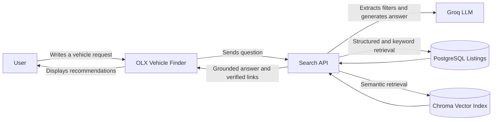
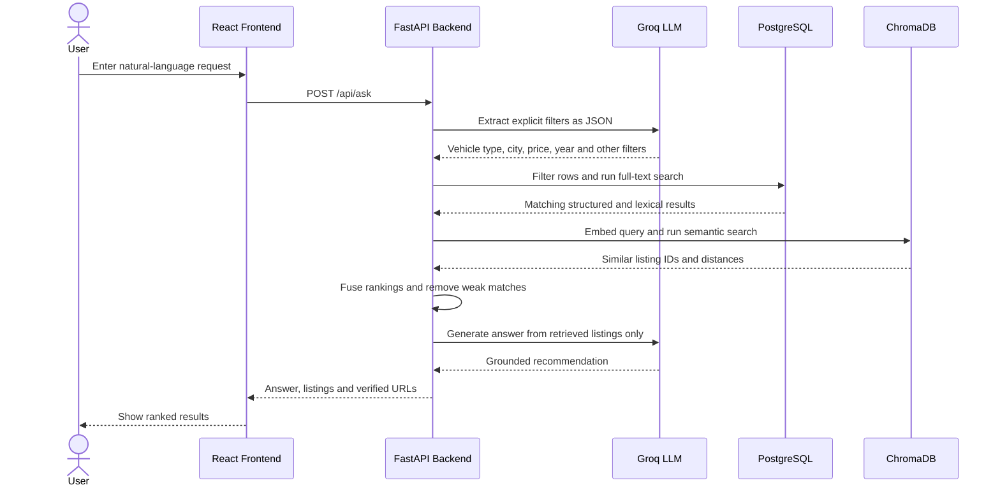
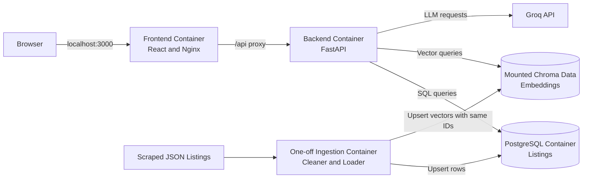
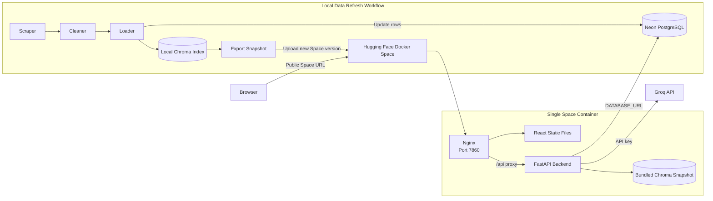

# OLX Vehicle Finder

## Overview

This is a RAG-based vehicle search application built for OLX Pakistan listings. A user can write a natural-language request such as `show family cars under 35 lakh in Lahore`, and the system returns grounded recommendations with verified OLX links.

The project combines PostgreSQL filters, full-text search, Chroma vector search, reciprocal rank fusion, and a Groq-hosted LLM. The frontend is built with React and the backend is exposed through FastAPI.

## Why did I make this effort?

Normal keyword search becomes limiting when a user describes intent instead of exact listing fields. For example, the user may ask for a comfortable family car without naming a model.

My goal was to understand how a complete RAG system works beyond a basic vector search demo: scraping data, cleaning it, storing structured fields, generating embeddings, combining lexical and semantic retrieval, grounding the answer, evaluating retrieval, and deploying the final application.

## Tech Stack

| Technology | Purpose |
|---|---|
| React and Vite | Search interface |
| Nginx | Serves the frontend and proxies API requests |
| FastAPI | Backend API |
| PostgreSQL | Structured listing data and full-text search |
| ChromaDB | Persistent vector index |
| Sentence Transformers | Local listing and query embeddings |
| Groq API | Filter extraction and grounded answer generation |
| Docker Compose | Local service orchestration |
| Neon | Free hosted PostgreSQL database |
| Hugging Face Spaces | Free Docker deployment for the demo |

## Architecture

The diagrams below follow a C4-inspired structure. The context, container, and deployment views come from the C4 way of describing systems. The sequence diagram is added as a dynamic view because it is useful for explaining the request flow in an interview.

### 1. System Context and User Flow

This first view shows what happens when a user searches from the application.



### 2. Search Request Sequence

This is the flow for one user request after the application is running.



### 3. Local Container Diagram

This C4 container view shows the services used while developing locally with Docker Compose.



### 4. Free Deployment Diagram

The deployed demo does not run four separate public containers. Hugging Face Spaces builds one Docker image containing Nginx, the React frontend, FastAPI, and a read-only Chroma snapshot. PostgreSQL is hosted separately on Neon.



## How RAG Works In This Project

Each vehicle listing is treated as one retrieval document. The cleaner converts messy scraped fields into consistent values and creates embedding text from useful listing information such as title, description, city, price, year, mileage, fuel type, and gearbox.

The loader stores the same listing in two places:

| Storage | What it contains | Why it is used |
|---|---|---|
| PostgreSQL | Normalized listing fields and URLs | Exact filters, full-text search and final listing details |
| ChromaDB | Embedding vector, metadata and PostgreSQL listing ID | Semantic similarity search |

At search time, the backend extracts only explicit filters from the user's question. It searches PostgreSQL and ChromaDB, combines the rankings using reciprocal rank fusion, rejects weak semantic matches using a distance threshold, and asks the LLM to answer only from the retrieved listings.

## Project Structure

```text
olx_rag-main/
|-- backend/                 # FastAPI API, LLM prompts and retrieval logic
|-- database/                # PostgreSQL schema and initialization SQL
|-- deploy/huggingface/      # Space config and exported Chroma snapshot
|-- evals/                   # Retrieval evaluation queries and runner
|-- frontend/                # React application and local Nginx config
|-- scraper/                 # Scrapers, cleaner and PostgreSQL/Chroma loader
|-- tests/                   # Cleaner tests
|-- .env.example             # Local configuration template
|-- docker-compose.yml       # Local multi-container setup
|-- Dockerfile               # Single-container Hugging Face deployment
`-- README.md
```

## Run Locally

### 1. Configure Environment

Create your private `.env` file from the example:

```powershell
Copy-Item .env.example .env
```

Set `GROQ_API_KEY` in `.env`. Keep `.env` private and never commit it.

### 2. Start The Application

Build and start PostgreSQL, the backend, and the frontend:

```powershell
docker compose up --build -d postgres backend frontend
```

Open:

| Service | URL |
|---|---|
| React frontend | `http://localhost:3000` |
| FastAPI Swagger docs | `http://localhost:8000/docs` |
| FastAPI health check | `http://localhost:8000/health` |

### 3. Stop The Application

```powershell
docker compose down
```

Your local PostgreSQL data remains in its Docker volume. Do not add `-v` unless you intentionally want to remove that database volume.

## Refresh Listing Data

The application can run from the existing dataset. Use this workflow only when you want to collect and load fresh listings.

```powershell
python scraper\scraper_v2.py
python scraper\scraper_v3.py
python scraper\cleaner.py
python scraper\loader.py
```

The scrapers write JSON files under `scraper/data/`. The cleaner creates `clean_listings.json`. The loader upserts listings into PostgreSQL and writes embeddings to `scraper/chroma_data/`.

For a fully Docker-based local ingestion run:

```powershell
docker compose --profile ingestion run --rm ingestion
```

Stop the backend before a manual loader run if it is using the same local Chroma directory. This avoids two processes writing to the persistent vector store at the same time.

## Free Deployment

The free demo deployment uses:

| Platform | Responsibility |
|---|---|
| Neon | Hosted PostgreSQL listings database |
| Hugging Face Spaces | Docker image, React UI, FastAPI backend and bundled Chroma snapshot |
| Groq | Hosted LLM inference |

### Update Neon And Chroma

Place the Neon connection string in your private `.env` file as `DATABASE_URL`, then run:

```powershell
python scraper\loader.py
.\deploy\huggingface\export_chroma.ps1
```

The first command updates Neon and the local vector store. The second command copies the current Chroma snapshot into `deploy/huggingface/chroma_data/` for the Space image.

### Upload A New Space Version

Add these secrets in the Hugging Face Space settings:

| Secret | Value |
|---|---|
| `DATABASE_URL` | Neon PostgreSQL connection string |
| `GROQ_API_KEY` | Groq API key |

Upload the project:

```powershell
hf upload abd04/carFinder . . --repo-type space --commit-message "Deploy OLX vehicle finder"
```

For a documentation-only update, upload only this file:

```powershell
hf upload abd04/carFinder README.md README.md --repo-type space --commit-message "Update README"
```

The Space may need a short cold start before the first search works.

## Environment Variables

| Variable | Used for |
|---|---|
| `POSTGRES_USER` | Local PostgreSQL username |
| `POSTGRES_PASSWORD` | Local PostgreSQL password |
| `POSTGRES_DB` | Local database name |
| `POSTGRES_HOST` | Local database host |
| `POSTGRES_PORT` | Local database port |
| `POSTGRES_HOST_PORT` | PostgreSQL port exposed by Docker |
| `DATABASE_URL` | Cloud Neon connection string |
| `GROQ_API_KEY` | Groq authentication |
| `GROQ_MODEL` | Groq model name |
| `MAX_VECTOR_DISTANCE` | Threshold for rejecting weak vector matches |
| `CHROMA_PATH` | Persistent Chroma directory inside a container |

## API Endpoints

| Method | Endpoint | Description |
|---|---|---|
| `GET` | `/health` | Checks whether the backend is running |
| `POST` | `/ask` | Runs full retrieval and returns a grounded answer |
| `POST` | `/search` | Returns retrieval results for debugging and evaluation |

The React frontend calls `/api/ask`. Nginx removes the `/api` prefix when proxying the request to FastAPI.

## Evaluation And Tests

Run the cleaner tests:

```powershell
python -m unittest discover -s tests
```

Run retrieval evaluation while the backend is available:

```powershell
python evals\run_retrieval_eval.py
```

The evaluation runner uses the `/search` endpoint and the sample queries in `evals/queries.json`.

## Interview Explanation

A concise explanation of the project is:

> I built a hybrid RAG vehicle finder over scraped OLX listings. PostgreSQL handles exact filters and lexical search, while Chroma handles semantic search over listing embeddings. Both stores use the same listing IDs, so the backend can fuse the rankings and fetch verified listing details. A Groq-hosted LLM extracts explicit filters and generates an answer only from retrieved records. Locally, the services run with Docker Compose. For the free public demo, Neon hosts PostgreSQL and a Hugging Face Docker Space runs the React frontend, FastAPI backend, and a bundled Chroma snapshot.

## Current Limitations

- The public Chroma index is a snapshot, so refreshing cloud data requires re-exporting and uploading the Space.
- Scraped OLX listings can expire or change after collection.
- The demo uses a local embedding model inside the backend image, which increases image size and cold-start time.
- This is a portfolio project, not a production marketplace service.
